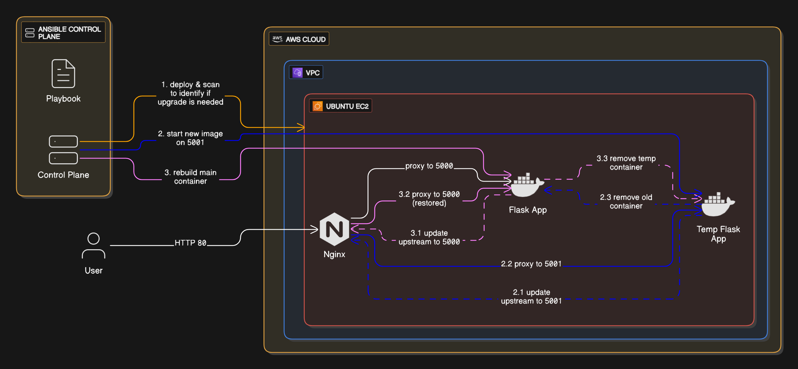

# Zero-Downtime Container Patching with Ansible, Docker and Nginx

This project demonstrates how to achieve **zero downtime patching** of Docker containers using **Ansible**, **Docker**, and **Nginx**.

## The Problem

**How can we safely patch base image vulnerabilities in running Docker containers across a fleet of EC2 instances without downtime?**

Modern applications often run in containers that are built on top of base images. These base images can accumulate critical vulnerabilities over time, but teams often skip patching because:

- Restarting containers can cause downtime
- App image is not updated frequently
- No process exists to detect or respond to silent base-layer risks

## The solution

The main focus is on automating safe, zero-downtime upgrades of a Flask app deployed in Docker containers on **EC2 instances**, by:

- Mirroring **blue/green** deployment strategy at the container level
- Detecting base image vulnerabilities with **Trivy**
- Rebuilding images when the base layer (Ubuntu) changes
- Deploying new containers on a temporary port
- Redirecting traffic with **Nginx reverse proxy**
- Removing old containers only after verifying traffic is switched
- Preserving availability throughout the entire process
- Supporting **rollback strategy** to last known-good image in case of failures

## Tech Stack

- **Ansible**
- **Docker**
- **Nginx**
- **Trivy**
- **AWS EC2**

## Overview Diagram

> Diagram illustrates control flow from Ansible to EC2 instances, container lifecycle, and Nginx port switching.

## Docs

- [full EC2 setup guide](docs/aws-ec2.md) for details.
- [deployment flow documentation](docs/deployment-flow.md) for a step-by-step explanation.
- [check the rollback strategy](docs/rollback.md).
- [check directory structure](docs/ansible-directory.md)
