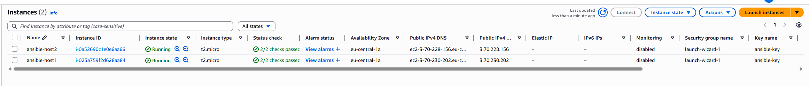
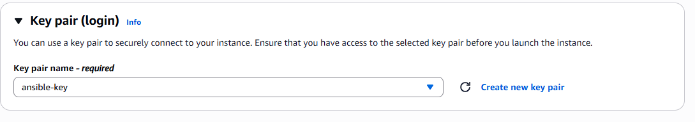

# EC2 SETUP

Two EC2 instances are launched with the following specifications:

- t3.micro
- Ubuntu 20.04
- Create and download a key pair (ansible-key.pem)
- Enable port 22 (SSH) and port 80 (Nginx) in the security group

On each instance run/install the following:

```groovy
sudo apt update
sudo apt install -y docker.io
sudo usermod -aG docker ubuntu
sudo apt install -y nginx
sudo systemctl enable --now docker
sudo systemctl enable --now nginx
```

To activate nginx config:

```groovy
sudo ln -s /etc/nginx/sites-available/flask /etc/nginx/sites-enabled/
sudo nginx -t
sudo systemctl reload nginx
```



> EC2 Instances running


> Security groups rules



> Key Pairs
