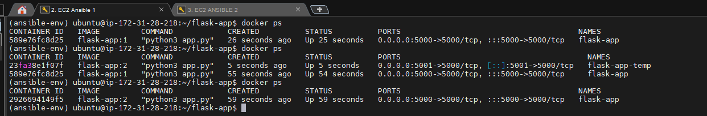
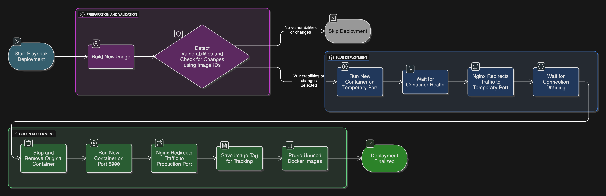

# Deployment Flow

Reference: [site.yml](../playbooks/site.yml)
The Ansible playbook is structured using modular roles, each representing a phase of the deployment lifecycle:

```yaml
roles:
  - build_image
  - detect_vuln
  - run_container
  - nginx_temp_switch
  - nginx_switch_to_new
  - finalize_deployment
```

## 1. Build Image

Gets the current deployed image tag and converts to number and increments by 1 to apply an incremental approach.
Builds a new image using the latest ubuntu base image specified in the dockerfile and tags with the incremental number

[build_image](../roles/build_image/tasks/main.yml)

## 2. Detect Vulnerabilities

Identifies if a new deployment is needed by:

- Scanning the live image for any critical vulnerabilities using trivy
- Compraing the ID of the live image against the new image

Deployment is skipped if no vulnerabilties/changes are detected

[detect_vuln](../roles/build_image/tasks/main.yml)

## 3. Run container

- Saves the current deployed image to a file for rollback purposes before deploying new containers
- Runs a new container on temporary port 5001 using the image from task 1.
- Waits to become healthy

[run_container](../roles/build_image/tasks/main.yml)

## 4. Nginx Temporary Switch

Once the new container is healthy:

- Patches nginx config to redirect traffic to port 5001
- Waits a few seconds for connection draining to ensure live traffic is gradually redirected without cutting off existing connections.

[nginx_temp_switch](../roles/build_image/tasks/main.yml)

## 5. Nginx switch to new

- Stops and removes the original container
- Runs a container on port 5000 using the new image
- Patches nginx config to redirect traffic to port 5000

[nginx_switch_to_new](../roles/build_image/tasks/main.yml)

## 6. Finalize Deployment

- Saves the current image tag to a txt file for tracking purposes
- Prunes unused docker images to reduce disk usage
- Stops and deletes temporary container

  [finalize_deployment](roles/build_image/tasks/main.yml)



> The above image demonstrates the state of containers during deployment. Intially only one container is active with image tag 1. During deployment and nginx traffic switch two containers are active running differnet image versions. Lastly, only the newest container is left running on the original 5000 port.


