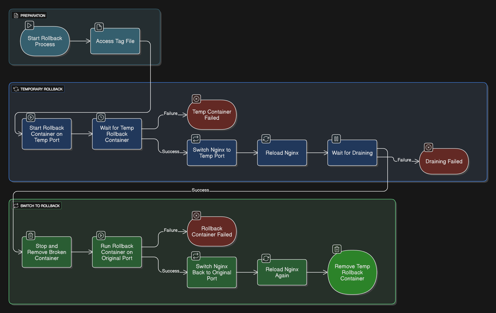

# Rollback

Allows to rollback to the latest stable image in the event of a faulty deployment by mirroring blue/green rollback strategy. Follows the same flow as the site playbook with the only difference being the pre-defined image tag.

## Flow

- Access the previous image tag from file last_deployed_image.txt.previous
- Start rollback container on temporary port 5001 using the previous image
- Switch Nginx traffic to the rollback container
- Remove the original/faulty container
- Run the rollback container on the original port
- Route Nginx traffic back to the production port
- Remove the temporary container

[rollback](../playbooks/rollback.yml)

